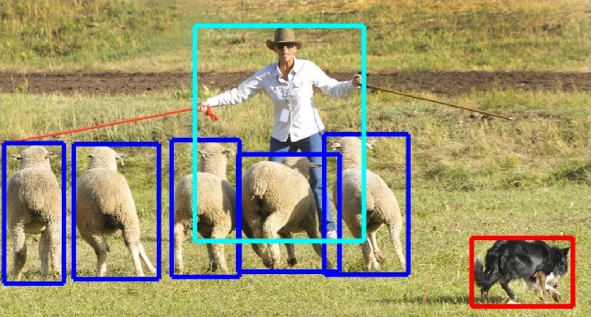

# tfodapi

Introduction to Object Detection with Convolution Neural Networks Using the TensorFlow API

*Author: Abel Brown (abelb@nvidia.com)*

*
Image credit: Lin et al, Microsoft COCO: Common Objects in Context
*

# Overview
  This workshop is a lightning introduction to object detection and image segmentation for data scientists, engineers, and technical professionals.  This task of computer-based image understanding permeates many major fields such as advertising, smart cities, healthcare, national defense, robotics, and autonomous driving.  Ultimately, the goals of this course are to provide a broad context and clear roadmap from traditional computer vision techniques to the most recent state-of-the-art methods based on deep learning and convolution neural networks (CNNs).   Working our way from classic CV algorithms up through the R-CNN family of deep learning based solutions, we discuss how to incrementally leverage CNNs to iteratively improve performance and expand image understanding capabilities.  We then dive deep into the Microsoft Common Object in Contexts dataset and the Google object detection API in TensorFlow.  We will get our hands dirty understanding accuracy vs. performance trade-offs between state-of-the-art models such as Single Shot Multibox Detectors (SSDs) and Faster R-CNN with residual networks.  Finally, we set the stage for network deployment, at the edge or on the road in an autonomous vehicle, using NVIDIA's latest TensorRT release.
